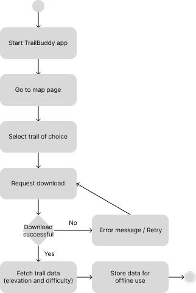
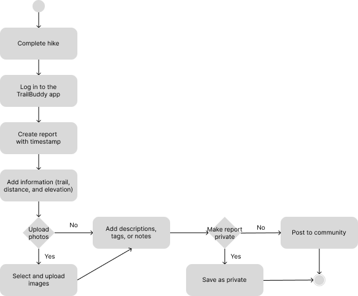

# Specification Phase Exercise

A little exercise to get started with the specification phase of the software development lifecycle. See the [instructions](instructions.md) for more detail.

## Team members

See instructions. Delete this line and replace with a list of the names of your team members, including links to each one's GitHub profile.

Connor Lee (<https://github.com/Connorlee487>)

Evelynn Mak (<https://github.com/evemak>)

Hyunkyu Park (<https://github.com/hyunkyuu>)

Nicole Zhang (<https://github.com/chzzznn>)

Lanxi Lin (<https://github.com/player1notfound>)

## Stakeholders
Gigi Ma - College Student, Beginner Hiker

Gigi is a college student who wants to build on her interest in hiking by finding more trails and connecting with other hikers. 

### Goals 
When asked about her biggest goal in hiking. Gigi wishes that there was a way to properly log her hikes and see her progression. "I am just starting to hike more frequently, but I want to be able to get better by climbing different trails. I wish I could see the progression in difficulty, as well as keep track of statistics so it is easier for me to visualize and keep track of my improvement".

When asked what her biggest need is as hiking as a beginner, Gigi expressed that safety is her number one priority, especially as a beginner where she has not found a solid community to go hiking with yet. "I would like to have a feature that would allow me have my family or friends be updated on my trail itinerary and live location. I would also like to have a quick way to update my friends and family every once in a while to let them know that I am safe and okay".

When asked what would help Gigi become a better hiker, Gigi expresses that it would be nice to be able to learn more technical facts about each trail, as well as hear what other people are saying about the trail. "It would be nice to learn fun facts about the trail that help me keep connected to hiking and nature. It would be nice to know if there are any secret viewing spots that other people have come across or know the history behind the trial that I am hiking so that I can enjoy my journey more and stay informed"

When asked what could keep hiking motivating or fun, especially when facing a lot of new challenges as a beginner hiker, Gigi mentions that it would be nice to have a place where she can set and complete goals. "It would be motivating if there can be a way where I can set hiking goals for myself and to be able to see them completed. I would also want to let people know about the hiking goals I accomplished and the trails that I completed".

### Problems and Frustrations
When asked whether or not she likes to hike alone. Gigi expressed that she likes to hike alone, but more often because she finds it difficult and frustrating to find people to hike with. "I want to be able to connect with people around my area who vary in experience level. I want to be able to see what trails people are thinking about hiking, so that I can match with someone and hike with them".

When asked about her frustrations and problems with current hiking resources out there, Gigi expressed that trail conditions are not updated as often, and information about trails are often scattered around different parts of the internet and hard to find. 

"I wish there was an easier way to know the current conditions of a trail, and whether the current weather would make the trail ideal for hiking. I want to be able to make decisions about my hikes much quicker. I also want to know what people think of the trail recently, and whether or not the trails I go on have been maintained recently. It is hard to do so currently as information I have about the trails I want to hike are all over the place and sometimes outdated. I want to be able to find information about trails from hikers I trust as well". 

On the same note, Gigi also is frustrated when she cannot navigate due to having no internet connection while hiking sometimes. "I want to be able to navigate through my trail on my phone without worrying about going offline. I find it frustrating and troublesome whenever my naviation for my trail does not load because I am not connected to the internet."

When asked about her frustrations with current navigation apps, Gigi thinks that such apps are not as interactive. "I feel like all the other navigation apps out there are just to help out with where to go, but I want to be able to have an app where I am able to find new trails to go on based on what I previously hiked or liked. I want to be able to quickly find trails based on features I like as well, like find trails with waterfalls, views or even wild animals, and have that easily accessible". 

## Product Vision Statement

**TrailBuddy empowers every hiker to explore nature safely and confidently by combining intelligent offline navigation, real-time safety features, and community-driven insights in one comprehensive outdoor companion app.**

## User Requirements

1. **As a hiker**, I want to download offline trail maps with elevation and difficulty ratings so that I can navigate safely even without cell service.

2. **As a solo hiker**, I want to automatically share my location with emergency contacts so that my loved ones know where I am if something goes wrong.

3. **As a hiker**, I want to press an "I'm safe" button to ping my emergency contacts so that they know I've completed my hike successfully.

4. **As a hiker**, I want my phone to detect if I fall and send a distress signal when I regain service so that help can find me quickly in an emergency.

5. **As a hiker**, I want to quickly log my hikes with photos, distance, and elevation so that I can track my progress and remember great trails.

6. **As a hiker**, I want to earn badges for completing different hiking challenges so that I feel motivated to explore more trails and improve my skills.

7. **As a hiker**, I want to share mini trail reports with the community so that other hikers can benefit from my experience and trail conditions.

8. **As a solo hiker**, I want to match with nearby hikers by trail, pace, or skill level so that I can find hiking companions for safety and social connection.

9. **As a hiker**, I want to mark recent wildlife sightings (bears, birds, wildflowers) so that other hikers know what to look for on the same trail.

10. **As a hiker**, I want to see real-time trail conditions (muddy, snow, closures) updated by other users so that I can plan accordingly and avoid dangerous situations.

11. **As a hiker**, I want to see water sources marked on trail maps so that I can plan my hydration and know where to refill my bottles.

12. **As a safety-conscious hiker**, I want to flip on "safety buddy" mode to notify others hiking the same trail so that we can look out for each other without hiking together.

## Activity Diagrams

UML Diagram 1: As a hiker, I want to download offline trail maps with elevation and difficulty ratings so that I can navigate safely even without cell service.

*This activity diagram illustrates the complete user flow for downloading offline trail maps in the TrailBuddy app. The process begins when a hiker opens the app and navigates to the map page, where they can select their desired trail and request a download. The diagram shows the decision point for download success, with error handling that allows users to retry failed downloads. Upon successful download, the system fetches trail data including elevation and difficulty ratings, then stores this information for offline use, ensuring hikers can navigate safely even without cellular service.*

*In addition to the basic download flow, the diagram highlights how the system validates network availability and handles cases where service is interrupted. If the download fails, an error message is displayed immediately, prompting the user to either retry or select a different trail. Once successful, the data package includes not only maps but also metadata such as trail length, elevation gain, difficulty classification, and nearby water sources. The storage step ensures these files are cached locally on the device in a format optimized for offline rendering, minimizing load time on the trail. This complete workflow emphasizes resilience (retry logic), data richness (elevation + difficulty ratings), and user empowerment (access to critical navigation data in service dead zones).*

UML Diagram 2: As a hiker, I want to quickly log my hikes with photos, distance, and elevation so that I can track my progress and remember great trails.

*This activity diagram illustrates the user flow for creating and sharing a hike report in the TrailBuddy app. The process begins once a hiker completes a hike and logs in to the TrailBuddy app. The user then creates a new report, which automatically includes a timestamp, and adds essential details such as trail name, distance, and elevation. At this stage, users can optionally upload photos, add descriptions, tags, or notes to enhance the report. A decision point follows where users choose whether to keep the report private or share it publicly. Private reports are saved to the user’s account, while public reports are posted to the community, enabling knowledge sharing and helping other hikers plan their trips.*

*The diagram also shows branching options for adding media and context to enrich the report. If users choose to upload photos, they can either select images from their gallery or capture new ones in-app, ensuring flexibility. Additional notes allow hikers to tag wildlife sightings, trail conditions, or personal milestones, which makes the log more valuable both personally and to the community. At the decision node, if the report is saved privately, it becomes part of the user’s personal hiking history and can be accessed later to track progress. If published publicly, the report is shared on a community feed where other hikers can search, filter by trail, and learn from recent experiences. This dual-path structure balances personal journaling with community-driven information sharing, giving the hiker full control over visibility while reinforcing TrailBuddy’s goal of safety, connection, and motivation.*

## Clickable Prototype

[Clickable Prototype](https://www.figma.com/proto/WUatCc0R5kj8yIqqZ7ISta/please_join-figma?node-id=120-723&p=f&t=nPdsNznPTUXjmN8E-1&scaling=scale-down&content-scaling=fixed&page-id=106%3A184&starting-point-node-id=120%3A723)
